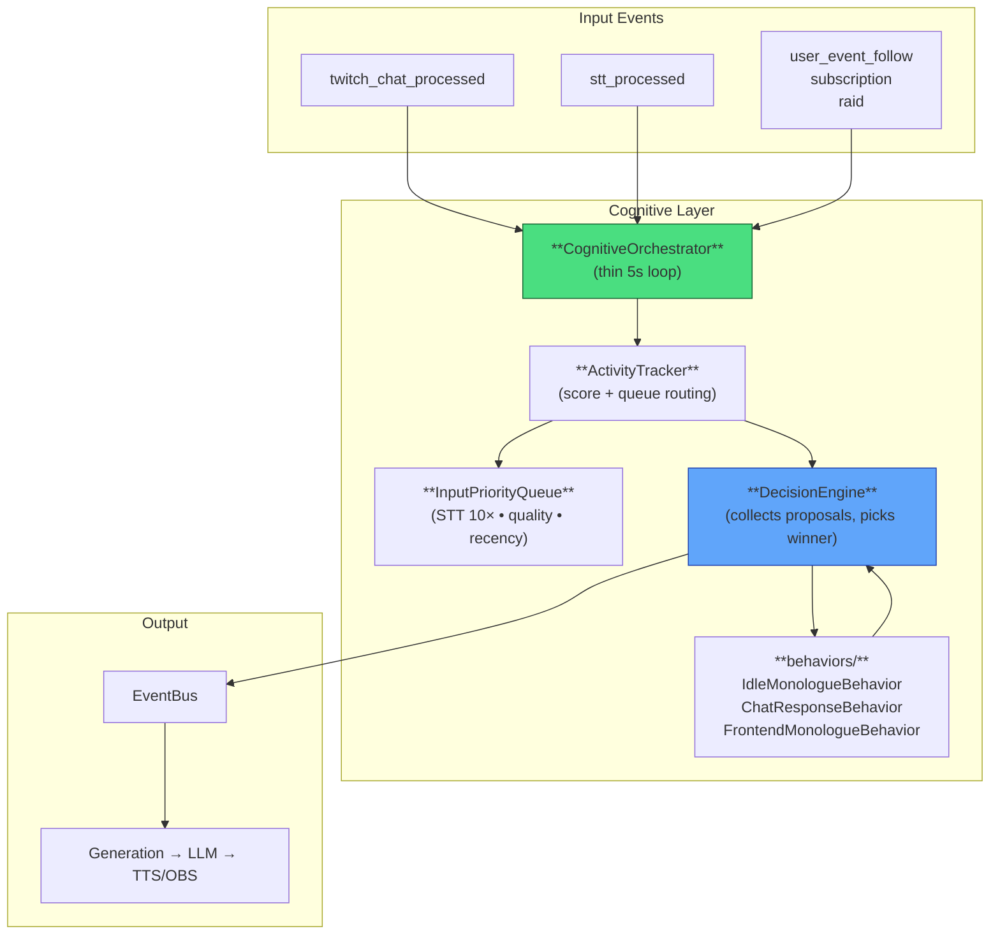

# Cognitive Layer (Scored Proposal Model)

The **CognitiveOrchestrator** is the single place that decides the bot's next high-level action.

Core principles (May 2026 redesign):
- STT (live streamer voice) has **absolute priority** at every activity level.
- Low activity → high willingness for both autonomous speech **and** responding to the few human messages that exist.
- High activity → selective (only strong STT + high-quality chat), while still allowing occasional autonomous color so the bot never feels like a pure Q&A machine.
- Everything is decided via **scored proposals** from pluggable behaviors. The highest score wins each 5 s cycle.

## Decision Model

- Every behavior (IdleMonologue, ChatResponse, FrontendMonologue, future raid/emote/etc. behaviors) implements `tick(context) → proposal | None`.
- A proposal is `{ "type", "score", "reason", ... }`.
- `DecisionEngine` collects proposals from **all** behaviors, applies STT tie-breaker (+10 to any STT response), and executes exactly one winner.
- No more hard activity windows or strict ordering. Dynamic willingness curves live inside each behavior.

## Key Behaviors

- **ChatResponseBehavior**: Dynamic willingness curve (eager at low activity, highly selective at high activity). STT messages receive massive score multipliers (2.6–2.8×) so streamer voice wins almost always.
- **IdleMonologueBehavior**: Very aggressive at low activity (< 3.5). Includes follow-up bonus after user responses so the stream feels conversational instead of stop-start. Still allowed small random interjections at higher activity.
- **FrontendTriggeredMonologueBehavior**: Operator commands get high base score (1.35) but still lose to live STT.

## Architecture

## Adding New Behaviors

Just implement the `Behavior` ABC (return scored proposals) and add the instance to `DecisionEngine.behaviors`. No ordering or gate changes required. STT responses will still dominate via the built-in +10 tie-breaker when appropriate.