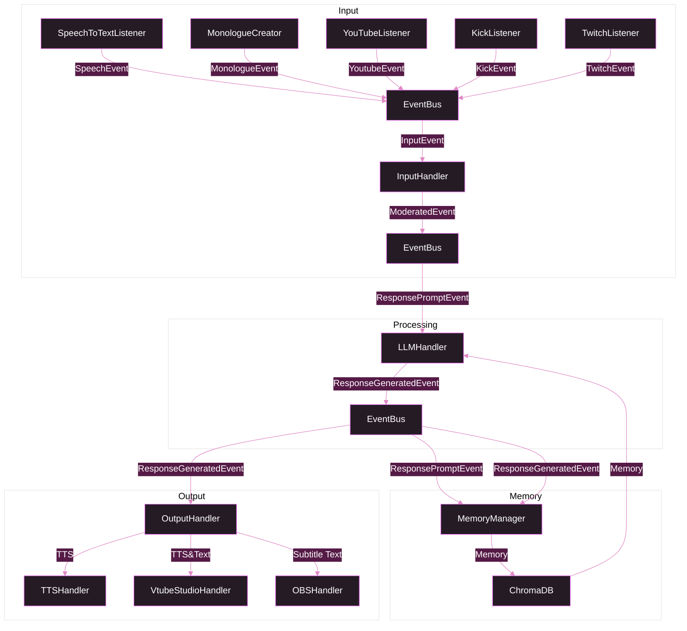

```mermaid

---
config:
    theme: 'base'
    themeVariables:
        primaryColor: '#251b25ff'
        primaryTextColor: '#fff'
        primaryBorderColor: '#f97cfdff'
        lineColor: '#e08ac5ff'
        secondaryColor: '#551a46ff'
        tertiaryColor: '#fff'
        padding: 200000

---

graph TD;

    subgraph Input
    SpeechToTextListener-->|SpeechEvent|1EventBus["EventBus"]
    MonologueCreator-->|MonologueEvent|1EventBus["EventBus"];
    YouTubeListener-->|YoutubeEvent|1EventBus["EventBus"];
    KickListener-->|KickEvent|1EventBus["EventBus"];
    TwitchListener-->|TwitchEvent|1EventBus["EventBus"];
    1EventBus["EventBus"]-->|InputEvent|InputHandler;
    InputHandler-->|ModeratedEvent|2EventBus["EventBus"];
    end

    subgraph Processing
    2EventBus["EventBus"]-->|ResponsePromptEvent|LLMHandler;
    LLMHandler-->|ResponseGeneratedEvent|3EventBus["EventBus"];
    end
    
    subgraph Memory
    3EventBus["EventBus"]-->|ResponsePromptEvent|MemoryManager;
    3EventBus["EventBus"]-->|ResponseGeneratedEvent|MemoryManager;
    MemoryManager-->|Memory|ChromaDB;
    ChromaDB-->|Memory|LLMHandler;
    end

    subgraph Output
        3EventBus["EventBus"]-->|ResponseGeneratedEvent|OutputHandler
        OutputHandler-->|TTS|TTSHandler
        OutputHandler-->|TTS&Text|VtubeStudioHandler
        OutputHandler-->|Subtitle Text|OBSHandler
    end
```